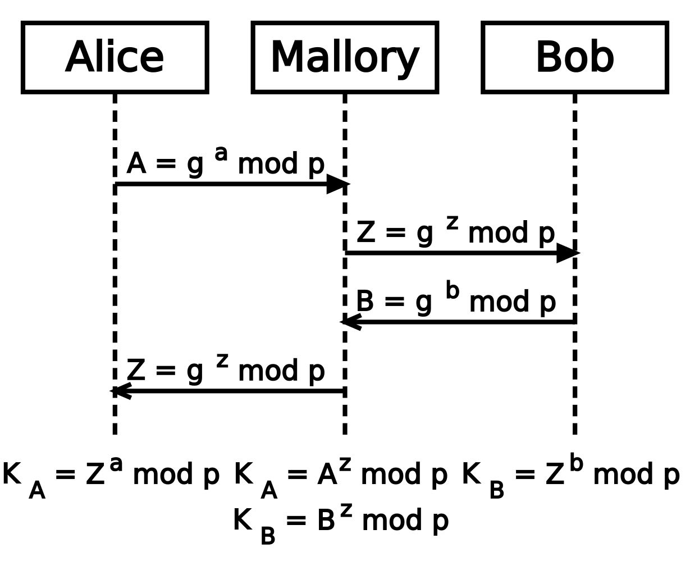

[Challenge 34 Set 5 - The Cryptopals Crypto Challenges](https://cryptopals.com/sets/5/challenges/34)

> ### Implement a MITM key-fixing attack on Diffie-Hellman with parameter injection
>
> Use the code you just worked out to build a protocol and an "echo" bot. You don't actually have to do the network part of this if you don't want; just simulate that. The protocol is:
>
> A->B
>
> Send "p", "g", "A"
>
> B->A
>
> Send "B"
>
> A->B
>
> Send AES-CBC(SHA1(s)\[0:16\], iv=random(16), msg) + iv
>
> B->A
>
> Send AES-CBC(SHA1(s)\[0:16\], iv=random(16), A's msg) + iv
>
> (In other words, derive an AES key from DH with SHA1, use it in both directions, and do CBC with random IVs appended or prepended to the message).
>
> Now implement the following MITM attack:
>
> A->M
>
> Send "p", "g", "A"
>
> M->B
>
> Send "p", "g", "p"
>
> B->M
>
> Send "B"
>
> M->A
>
> Send "p"
>
> A->M
>
> Send AES-CBC(SHA1(s)\[0:16\], iv=random(16), msg) + iv
>
> M->B
>
> Relay that to B
>
> B->M
>
> Send AES-CBC(SHA1(s)\[0:16\], iv=random(16), A's msg) + iv
>
> M->A
>
> Relay that to A
>
> M should be able to decrypt the messages. "A" and "B" in the protocol --- the public keys, over the wire --- have been swapped out with "p". Do the DH math on this quickly to see what that does to the predictability of the key.
>
> Decrypt the messages from M's vantage point as they go by.
>
> Note that you don't actually have to inject bogus parameters to make this attack work; you could just generate Ma, MA, Mb, and MB as valid DH parameters to do a generic MITM attack. But do the parameter injection attack; it's going to come up again.

> ### How to:
> Run all tests from this package:
>
>     cargo test --package _34_parameter_injection --lib tests
>
> Capture the flag:
>
>     cargo test --package _34_parameter_injection --lib tests::capture_the_flag -- --exact
> 
> 
